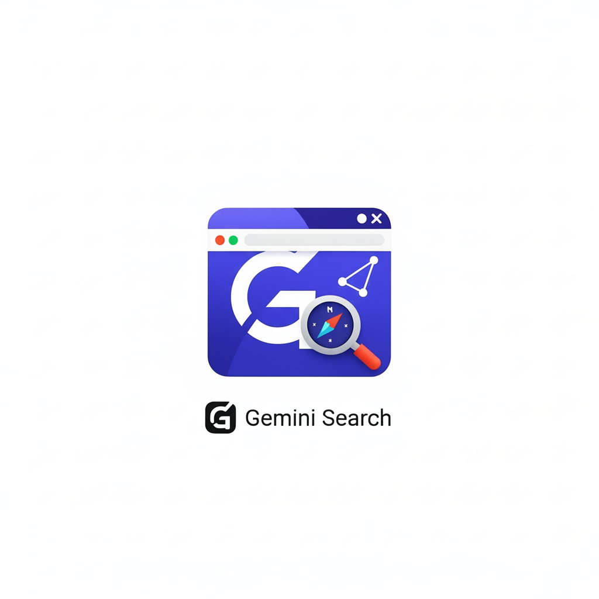

# 🔍 Gemini Search

<p align="center">
  
</p>

<p align="center">
  <em>Transform your browser into a unified search powerhouse</em>
</p>

<p align="center">
  <a href="https://github.com/Pratyay360/gemini-search/blob/master/LICENSE">
    
  </a>
  <a href="https://github.com/Pratyay360/gemini-search/releases/latest">
    
  </a>
  <a href="https://github.com/Pratyay360/gemini-search/issues">
    
  </a>
  <a href="https://chrome.google.com/webstore/">
    
  </a>
</p>

---

## 📖 Table of Contents

- [✨ What Is Gemini Search?](#-what-is-gemini-search)
- [🤔 Why Gemini Search Matters](#-why-gemini-search-matters)  
- [🚀 Key Features](#-key-features)
- [⚙️ Quick Start](#️-quick-start)
- [💻 Usage Examples](#-usage-examples)
- [🤝 How to Contribute](#-how-to-contribute)
- [📄 License](#-license)

---

## ✨ What Is Gemini Search?

**Gemini Search** is a lightweight Chrome extension that transforms your address bar into a unified search portal. By typing a simple "bang" command (`!g`, `!yt`, etc.), you can instantly redirect your query to Google, YouTube, DuckDuckGo, ChatGPT, Perplexity, and more—without opening new tabs or losing focus.

When you set Gemini as your default search engine and install this extension, typing **anything** directly in your address bar will send your query straight to Gemini AI for intelligent responses. Add a bang command to redirect to other platforms instantly.

<p align="center">
  <a href="assets/demo
  .webp" target="_blank">
    
  </a>
  <br />
  <em style="color: #666;">Click image to view demonstration</em>
</p>

---

## 🤔 Why Gemini Search Matters

Modern web users constantly switch between tabs and search engines, retyping the same query repeatedly. This context-switching drains productivity. Gemini Search eliminates that friction by letting you:

**🎯 Stay Focused**  
Type once in your address bar, hit Enter, and get instant results—no extra clicks required.

**⚡ Work Smarter**  
Use bang commands to choose the exact search engine you need without navigating away from your current workflow.

**🔒 Maintain Privacy**  
All query parsing and redirect logic run locally in your browser. We don't collect or track your data—ever.

> **Perfect for developers, researchers, and power users who value efficiency over effort.**

---

## 🚀 Key Features

### 🎯 Smart Bang Redirects

| Bang | Platform | Example Usage |
|------|----------|---------------|
| `!g` | 🔍 **Google** | `!g react tutorials` |
| `!yt` | 📺 **YouTube** | `!yt javascript crash course` |
| `!ddg` | 🦆 **DuckDuckGo** | `!ddg privacy tools` |
| `!ch` | 🤖 **ChatGPT** | `!ch explain quantum computing` |
| `!pr` | 🧠 **Perplexity** | `!pr climate change research` |

### ✨ Core Features

**⚡ Lightning-Fast Redirects**  
Type a bang command and instantly route to your chosen search engine with the query pre-filled.

**🤖 Default AI Integration**  
Queries without bang commands go directly to Gemini AI for intelligent assistance and explanations.

**🔒 Privacy-First Architecture**  
All processing happens locally—no external servers, no tracking, no data collection.

**🎨 Seamless Integration**  
Invisible background operation with no UI clutter or learning curve required.

**🌐 Cross-Platform Support**  
Works consistently across Windows, macOS, and Linux.

**💻 Modern Tech Stack**  
Built with TypeScript for reliability, leveraging the latest Chrome extension APIs.

---

## ⚙️ Quick Start

Get Gemini Search running in under 3 minutes:

### 1️⃣ Make Gemini Your Default Search Engine

1. Open Chrome Settings: `chrome://settings/searchEngines`
2. Under **Search Engine → Manage Search Engines**, click **Add** next to "Site Search"
3. Fill in these details:

```yaml
Search Engine:   Gemini
Shortcut:        g
URL:             https://gemini.google.com/app/?q=%s
```

4. Click **Add** and set **Gemini** as your default search engine
5. **🎉 Now typing anything in your address bar will send queries directly to Gemini!**

<p align="center">
  <a href="assets/usage.webp" target="_blank">
    
  </a>
  <br />
  <em style="color: #666;">Click image to view guide</em>
</p>

### 2️⃣ Install the Extension

#### Option A: From Source (Recommended for developers)

```bash
# Clone the repository
git clone https://github.com/Pratyay360/gemini-search.git
cd gemini-search

# Install dependencies
npm install

# Build the extension
npm run build
```

1. Open Chrome → `chrome://extensions`
2. Enable **Developer mode** (toggle in top-right)
3. Click **Load unpacked**
4. Select the `dist/` folder from your cloned repo

#### Option B: Chrome Web Store
*Coming soon!*

### 3️⃣ Start Searching

| **What You Type** | **What Happens** |
|-------------------|------------------|
| `machine learning` | 🤖 **Gemini AI** responds with intelligent explanations |
| `!g machine learning` | 🔍 **Google** search results with shopping options |
| `!yt how to code` | 📺 **YouTube** video tutorials and content |
| `!ddg secure browsers` | 🦆 **DuckDuckGo** privacy-focused results |
| `!ch write a poem` | 💬 **ChatGPT** creative AI assistance |

---

## 💻 Usage Examples

### 🤖 AI-Powered Queries (Default Behavior)
```
Type: "explain quantum physics"
Result: Gemini AI provides detailed explanations with examples
```

### 🔍 Traditional Search
```
Type: "!g best laptops 2024"
Result: Google search with reviews, shopping, and comparisons
```

### 📺 Video Content
```
Type: "!yt guitar tutorials"
Result: YouTube video lessons from beginner to advanced
```

### 🔒 Privacy-Focused Search
```
Type: "!ddg secure browsers"
Result: DuckDuckGo privacy-first search results
```

### 🧠 Research & Analysis
```
Type: "!pr climate change research"
Result: Perplexity with in-depth summaries and citations
```

### 💬 Creative AI Assistance
```
Type: "!ch code a weather app"
Result: ChatGPT with code scaffolding and explanations
```

---

## 🤝 How to Contribute

We welcome all contributions—bug reports, features, documentation, and code!

### 🚀 Getting Started

1. **Fork** the repository
   ```bash
   git clone https://github.com/yourusername/gemini-search.git
   ```

2. **Create** a feature branch
   ```bash
   git checkout -b feature/amazing-feature
   ```

3. **Make** your changes with clear, descriptive commits
   ```bash
   git commit -m "Add amazing feature"
   ```

4. **Push** and create a Pull Request
   ```bash
   git push origin feature/amazing-feature
   ```

### 🐛 Report Issues & Suggest Features

- **🐛 Bug Reports**: [Open an Issue](https://github.com/Pratyay360/gemini-search/issues)
- **💡 Feature Requests**: [Open an Issue](https://github.com/Pratyay360/gemini-search/issues)  
- **🔧 Pull Requests**: [Create a PR](https://github.com/Pratyay360/gemini-search/pulls)

---

## 📄 License

This project is licensed under the [GPL-3.0 License](https://github.com/Pratyay360/gemini-search/blob/master/LICENSE).

---

<p align="center">

  <a href="https://github.com/Pratyay360/gemini-search">⭐ Star this repo</a> • 
  <a href="https://github.com/Pratyay360/gemini-search/issues">🐛 Report Bug</a> • 
  <a href="https://github.com/Pratyay360/gemini-search/issues">💡 Request Feature</a>
</p>
